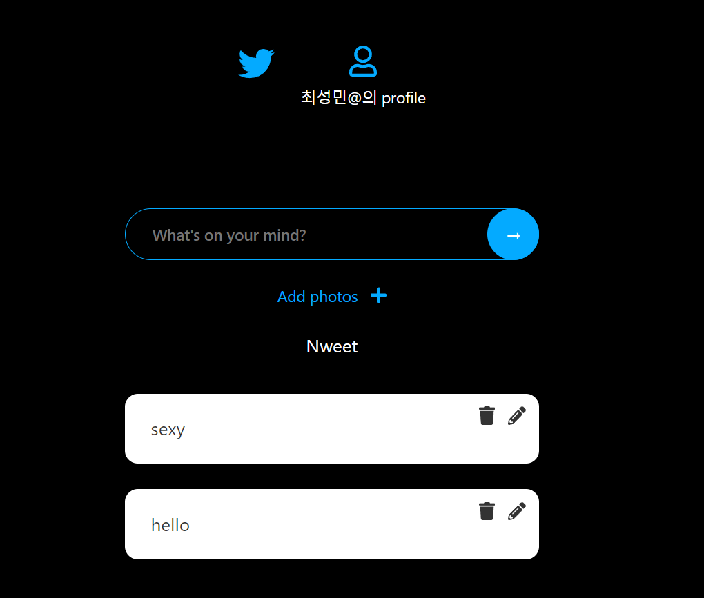
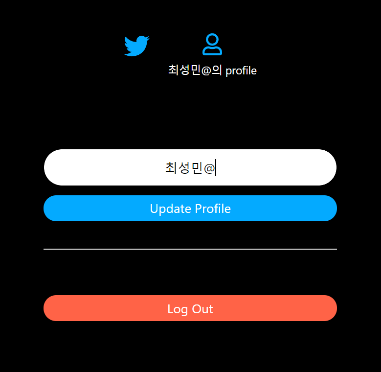

# ⚛ nwitter 토이 프로젝트
## ✨구현 장면

## 📌프로젝트 요구사항
- [X] 사용자가 로그인 했는지 안했는지 확인하기.
  - [X] 로그인 안했다면 Auth 화면으로.
    - [X] 이메일 ,비번 input 생성.
      - [X] Firebase 이용해서 이메일 회원가입 하기. 
    - [X] Google,Github 연동 로그인 버튼 생성.
      - [X] Google 연동 로그인 구현.
      - [X] Github 연동 로그인 구현. 
  - [X] 로그인 했다면 Home 화면으로.
    - [X] 네비게이션 컴포넌트 생성.
    - [X] text입력 폼 구현.
  - [X] Nweet 게시글 구현
    - [X] 본인이 쓴 게시글 이면 delete,Edit 버튼 시각화.  
      - [X] delete 버튼 구현.
      - [X] EditNweet 버튼 구현. 
        - [X] Edit 취소 버튼 구현.
    - [X] 이미지 업로드 버튼 생성.
  - [X] Profile 페이지 구현.  
    - [X] 프로파일 컴포넌트에 로그아웃 기능 구현. 
    - [X] 개인이 쓴 게시물 시각화.

## 🛠 Tech Stack

